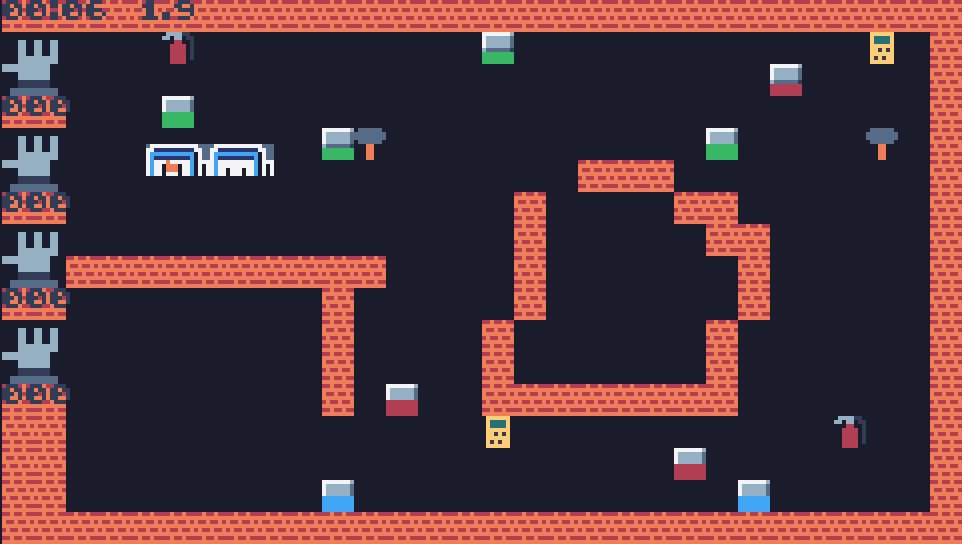

# Reinon Raksafirma

## Gameplay
Earn points by repairing machines. Using the wrong tool will cause damage 
to the machine and possibly destroy it. The machines will get more faults 
at an increasing rate over time. The game is over once all machines have  
completely broken down.  

|Damage  |Tool        |
|--------|------------|
|Broken  |Hammer      |
|Sparking|Multimeter  |
|Fire    |Extinguisher|

## Controls
Classic style [joystick](https://github.com/goodmicros/joystick-rj45) 
recommended for the best experience.  

|Intput    |Action             |
|----------|-------------------|
|directions|move               |
|A         |use                |
|~B~       |~drop current tool~|

## Credits
* by: [good micros](https://goodmicros.com)
* engine: [tic-80](https://tic80.com) 
